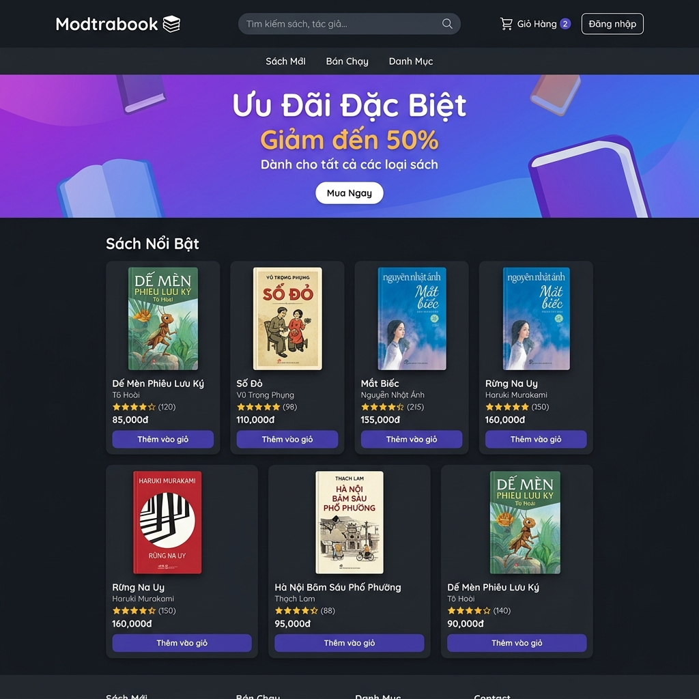
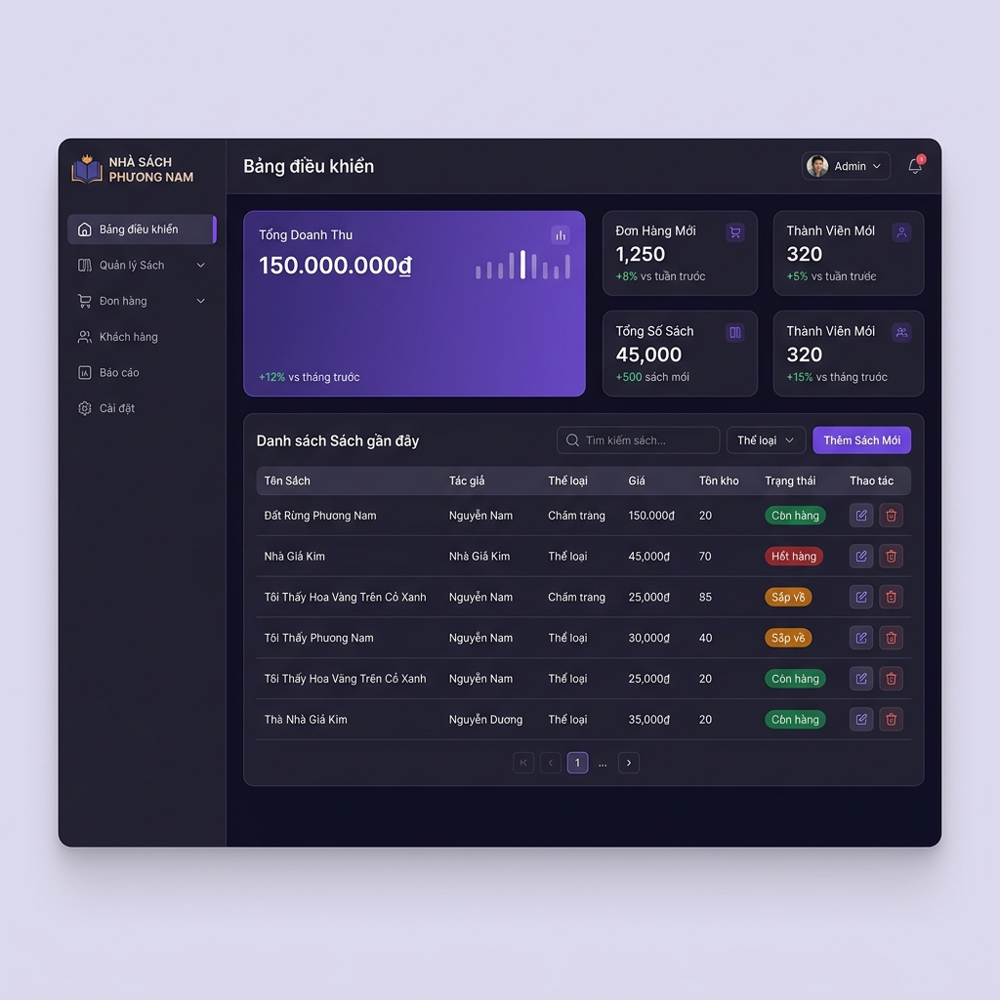

# 📚 Website Quản Lý Nhà Sách (Modtrabook)

Modtrabook là dự án Website Nhà Sách trực tuyến. Nhánh này tập trung phát triển và hoàn thiện các chức năng dành riêng cho **Quản trị viên (Admin)**, đặc biệt là phần Cài đặt hệ thống và Quản lý kho sách.

## 🌟 Giao Diện Minh Họa

### 🏠 Trang chủ (Giao diện người dùng)

*Giao diện danh sách sách trực quan giúp người dùng dễ dàng tìm kiếm và mua sắm.*

### ⚙️ Admin Panel - Quản lý sách

*Bảng điều khiển quản lý sách chuyên nghiệp, hỗ trợ Admin kiểm soát toàn bộ thông tin sách và hàng tồn kho.*

## 🚀 Chức năng chính (Admin Settings & Quản lý sách)

### 1. Quản Lý Sách (Book Management)
- **Danh sách tổng quan:** Hiển thị danh sách toàn bộ sách với các thông tin cốt lõi (Hình ảnh, Tên sách, Thể loại, Giá, Số lượng tồn kho, Trạng thái).
- **Phân loại thông minh:** Cải tiến hệ thống cho phép chọn và gán **nhiều thể loại** cho một cuốn sách (thay vì giới hạn 1 thể loại như trước đây).
- **Thao tác nhanh chóng:** Hỗ trợ tính năng thêm mới sách, chỉnh sửa thông tin chi tiết và xóa sách trực tiếp từ bảng dữ liệu.
- **Quản lý tình trạng kho:** Theo dõi và tự động cập nhật trạng thái sách (Còn hàng / Hết hàng) dựa trên số lượng tồn kho.
- **Lọc và tìm kiếm:** Tích hợp bộ lọc tìm kiếm giúp quản trị viên dễ dàng tra cứu một tựa sách bất kỳ.

### 2. Cài Đặt Hệ Thống (Admin Settings)
- **Trang Cài đặt tổng hợp:** Thiết kế lại toàn bộ giao diện Cài đặt (Settings). Gom nhóm các tùy chọn chính của hệ thống vào một trang duy nhất để dễ dàng quản lý mà không cần phải truy cập nhiều menu con.
- **Tối ưu hóa UI/UX Admin:** Menu sidebar (Quản lý sách, Mã giảm giá, Đối tác, Khách hàng) được sắp xếp trực quan, dễ thao tác và tập trung vào trải nghiệm người dùng.
